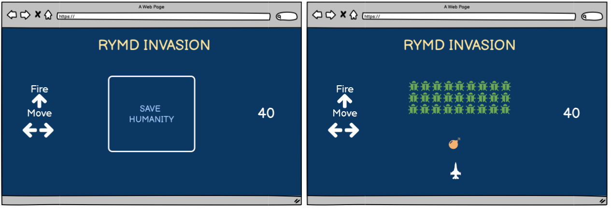
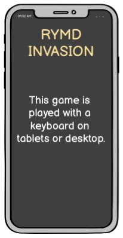
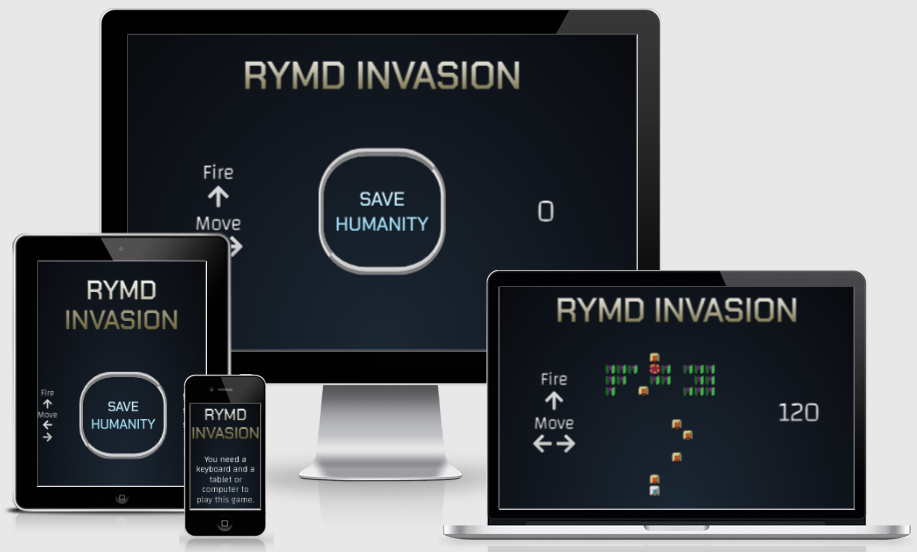
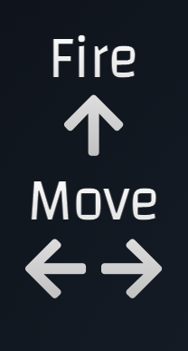
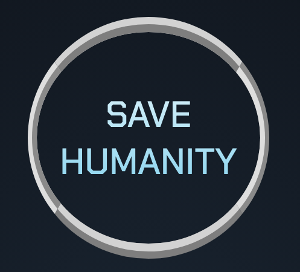
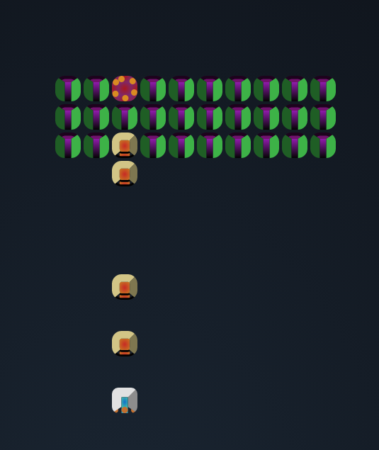
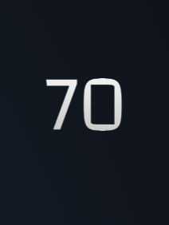
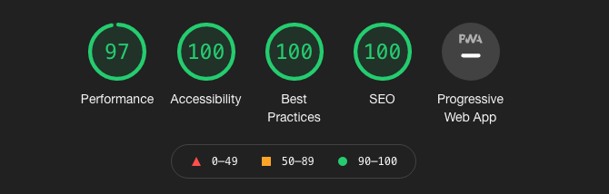
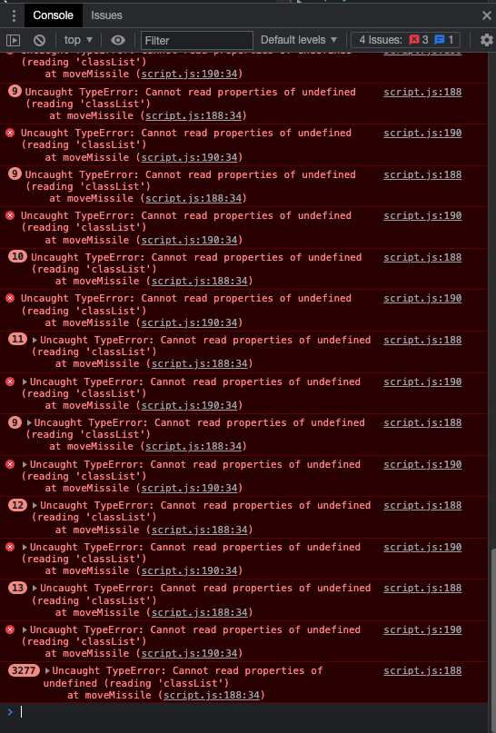
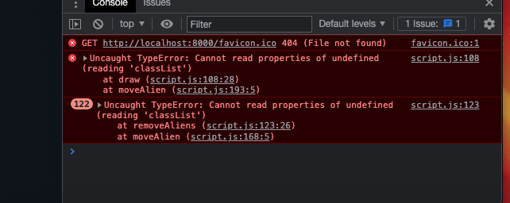

<h1 align="center" style="font-size: 250%;"><b>
RYMD INVADER
</b></h1>

[Check the live project here!](https://jfrdrkssn.github.io/second-project-ci/)

RYMD INVADER is a browser game based on the classic arcade game "Space Invaders". The goal is to eliminate the alien invaders by shooting them down with your spaceship. The purpose of the site is to provide a simple game for people to enjoy and spark feelings of nostalgia. Target audience is anyone looking to pass time. It is designed to be played with a keyboard on tablets or larger devices. Loading the page on mobile will provide the user with information on how to play the game.

---
## **User Experience (UX)**  
---  

- ### **User stories**  

      - As a User, I want it to be clear that the site is a browser game.
      - As a User, I want to intuitively understand how to operate the game.
      - As an Owner, I want the site to be clear and elicit positive emotions to encourage return visits.

- ### **Design**

    - **Colour Scheme**

        - A dark black and blue background coupled with bright grey, white and gold text provides clear contrast that is also easy on the eyes.
        - A large, bordered button with light blue and white text at the center of the page give users easy access and a visual cue to start the game.
        - Enemies are colored green and purple for easy recognition of their affiliation in the game.
        - Missiles are colored tan with a an orange center and bottom to imitate propulsion.
        - Explosions are colored red and orange to emulate fire.
        - The player ship has light grey and white colors with a light blue center to imitate glass and orange dots at the bottom to imitate propulsion.
    
    - **Typography**

        - The Chakra Petch font is used for the game title and button. The font has a modern, almost futuristic, and strong look that lends itself well to the space battle theme.
        - The Changa font is used for text and score content. It has a similar style to the Chakra Petch font and blends in well without adding too much visual contrast.
        - Sans-serif is used as a backup-font.

- ### **Wireframes**

---
## **Features**
---
- **Responsive on all device sizes**

    - [Am I Responsive?](http://ami.responsivedesign.is/?url=https://jfrdrkssn.github.io/first-project-ci/index.html)

---

- **Title**

    - At the top, the title of the game is displayed. Clicking it refreshes the page.
    - The title changes if the player has won or lost. When a player wins it changes to "VICTORY". If a player is defeated, it changes to "GAME OVER".

---

- **Instructions**

    - Center left on the page are simple instructions on how to play the game.

---

- **Start game**

    - Whenever the game is not running, a large CTA button to start the game is shown in the middle of the page. It reacts when hovering to clearly indicate it is clickable.

---

- **Game**

    - The game runs after clicking the start button.
    - It runs on a grid. Enemies move from top to bottom, left to right in three rows. The player is fixed vertically to the bottom while being able to move left and right.
    - The player can fire missiles to destroy enemies.
    - You win by destroying all enemies.
    - You lose if an enemy hits you or when they reach the last square in the grid.

---

- **Score**

    - On the right side a score tally is shown. Destroying an enemy provides 10 points.

---

- **Unfinished features**

Because of time restraint and debugging of source code, these features were planned but never implemented.

- The ability to save scores based on username.
- A Top Score list to showcase player top scores.
- More complexity to the scoring feature, like losing points for being hit.
- A time interval on firing missiles. This would make the game more challenging.
- Changing the enemy formation and movement speed on a new round after winning the game.
- The ability for enemies to fire their own missiles.
- A "lives" feature for the player when hit by enemy fire.

---
## **Technologies**
---

### **Languages**

-   [HTML5](https://en.wikipedia.org/wiki/HTML5)
-   [CSS3](https://en.wikipedia.org/wiki/CSS)
-   [JavaScript ES6](https://www.w3schools.com/js/js_es6.asp)

### **Programs**
1.  [Gitpod](https://gitpod.io)
    - Gitpod was used to host a virtual workspace.
2.  [VS Code](https://code.visualstudio.com/)
    - VS Code was used to write all code.
3.  [Git](https://git-scm.com/)
    - Git was used for version control by utilizing the Gitpod terminal to commit Git and Push to GitHub.
4.  [GitHub](https://github.com/)
    - GitHub is used to store the projects code after being pushed from Git.
5.  [Google Fonts](https://fonts.google.com/)
    - Google fonts was used to import the Chakra Petch and Changa fonts.
6.  [Font Awesome](https://fontawesome.com/)
    - Font Awesome was used to style instruction icons.
7.  [Balsamiq](https://balsamiq.com/)
    - Balsamiq was used to create wireframes for design purposes.
8.  [cssgradient.io](https://cssgradient.io/)
    - CSS Gradient was used to create colors on the site.

---
## **Testing**
---

The W3C Markup Validator, W3C CSS Validator Services and JSHint were used to validate the site to ensure there were no syntax errors in the project.

- [W3C Markup Validator]() - [Results](https://validator.w3.org/nu/?doc=https%3A%2F%2Fjfrdrkssn.github.io%2Fsecond-project-ci%2F)
- [W3C CSS Validator]() - [Results](https://jigsaw.w3.org/css-validator/validator?uri=https%3A%2F%2Fvalidator.w3.org%2Fnu%2F%3Fdoc%3Dhttps%253A%252F%252Fjfrdrkssn.github.io%252Fsecond-project-ci%252F&profile=css3svg&usermedium=all&warning=1&vextwarning=&lang=sv)
- [JSHint](https://jshint.com/)
    - JSHint show 28 warnings. They are all related to JavaScript versions, for example "'let' is available in ES6"

### **Testing User Stories from User Experience (UX) Section**

- **User Stories**

    - As a User, I want it to be clear that the site is a browser game.
        - The title name, instructions, button and score all point to the fact that it's game.
    - As a User, I want to intuitively understand how to operate the game.
        - The instructions are very easy to understand and clearly shown. The Arrow Up icon is shown above the Left and Right Arrow.
    - As an Owner, I want the site to be clear and elicit positive emotions to encourage return visits.
        - There's no clutter on the page and everything is clearly visible. The colors and style are easy on the eyes and for users who are familiar with the original game it provides a modern take that is true to the original.
        - Some key features are missing which are crucial for return visits. No sense of longevity or complexity is provided since difficulty never changes, scores can't be tracked and there's no username feature to help the player feel more connected to the game.

### **Further Testing**

- The website was tested on Chrome, Safari and Firefox browsers.
    - The site is designed on Chrome and works as it should.
    - Safari does not load fonts and icons properly. Some [Normalize CSS](https://github.com/necolas/normalize.css/) is used. Because of time restraint, further testing and validating for Safari has not been done.
    - Firefox works but font sizing is not correct. Some [Normalize CSS](https://github.com/necolas/normalize.css/) is used. Because of time restraint, further testing and validating for Firefox has not been done.
- The website was viewed on Desktop, iPhone 6.
- Friends and family viewed and tested the site to provide feedback.
- [Google Mobile-Friendly Test](https://search.google.com/test/mobile-friendly/result?id=3RCgp_ogfKRQhaEC742xgw) was used to test mobile version and came back validated.
- Lighthouse was used to test different parameters.

### **Bugs**

The base JS code is from a speed-coding challenge on [YouTube](https://www.youtube.com/watch?v=3Nz4Yp7Y_uA) by [Ania Kubow](https://github.com/kubowania). The source code had som bugs since it was never debugged properly. From a technical standpoint, copying the source code to debug and refactor it from the beginning would propably be much more time-efficient and effective. After coding along with the creator the idea was to implement my own features. This started introducing even more bugs. Except for slight adjustments and bug-fixes in the source code, only the menu() and startGame() functions are my own. I tried refactoring the code in multiple ways but time-restraint and more bugs made this impossible. This also introduced the bad practice of putting all game functions into a single function to run them all. Essentially, this is a MVP where the code works and runs bug-free but it could be improved a lot.

- When missiles moved outside the grid it introduced an infinite loop.
    - Fix: Added if statements to line 200 and 203 in script file.

- When enemies moved outside the grid, i.e were not defeated or hit the player, it introduced an infinite loop.
    - Fix: On line 170 in the script file, the if statement second condition was changed from (squares.length) to 224, the last square in the grid.

- When refactoring the code, some or all elements of the game were either not visible, didn't run and/or didn't loop properly.
    - No fixes. Putting all functions in the global scope and calling them in the startGame() function was unsuccessful. Moving variables, trying to change conditions, creating new variables and restructuring the code introduced more bugs and/or made the game function incorrectly.

---
## **Deployment**
---

### **GitHub Pages**

The project was deployed to GitHub Pages using the following steps...

1. Log in to GitHub and locate the GitHub Repository
2. At the top of the Repository (not top of page), locate the "Settings" Button on the menu.
3. Scroll down the Settings page until you locate "Pages" under the "Code and automation" Section.
4. Under "Source", click the dropdown called "None" and select "main" branch.
5. A link to the site will be displayed under the "GitHub Pages" title.
6. Wait for the background to turn green.
7. The site is now published!

---
## **Credits**
---

### **Code**

- The source code the project is based on can be found here [this repository](https://github.com/kubowania/space-invaders/blob/master/app.js). This projects code was written by following this [YouTube video](https://www.youtube.com/watch?v=3Nz4Yp7Y_uA) by [Ania Kubow](https://github.com/kubowania).

MIT Licence
Copyright (c) 2020 Ania Kubow
 
Permission is hereby granted, free of charge, to any person obtaining a copy of this software and associated documentation files (the "Software"), to deal in the Software without restriction, including without limitation the rights to use, copy, modify, merge, publish, distribute, sublicense, and/or sell copies of the Software, and to permit persons to whom the Software is furnished to do so, subject to the following conditions:
The above copyright notice and this permission notice shall be included in all copies or substantial portions of the Software.
Translation: Ofcourse you can use this for you project! Just make sure to say where you got this from :)

- Some [Normalize CSS](https://github.com/necolas/normalize.css/) by Nicolas Gallagher was used to help with different browser styling.

- Background color code from https://codepen.io/saransh/pen/LYGbwj by [Saransh Sinha](linkedin.com/in/saranshsinha)

- Gradient text color from [cssgradient.io](https://cssgradient.io/)

### **Content**

- The structure and layout of this README.md was based on [this template](https://github.com/Code-Institute-Solutions/SampleREADME) by [Code Institute](https://codeinstitute.net/). Some text was also copied. Additional inspiration for this README.md was given from other templates in Code Institute's course curriculum and from fellow student Patrik Österljung ([GitHub](https://github.com/oljung)).

### **Acknowledgements**

- Ania Kubowa, the original creator of the source code that the game is built upon. [GitHub](https://github.com/kubowania)
- Saransh Sinha, the original creator of the background color code. [LinkedIn](linkedin.com/in/saranshsinha)
- My Mentor, Gerard McBride, for continuous helpful feedback and support.
- Fellow student Patrik Österljung, for peer review of code and insightful tips. [GitHub](https://github.com/oljung)